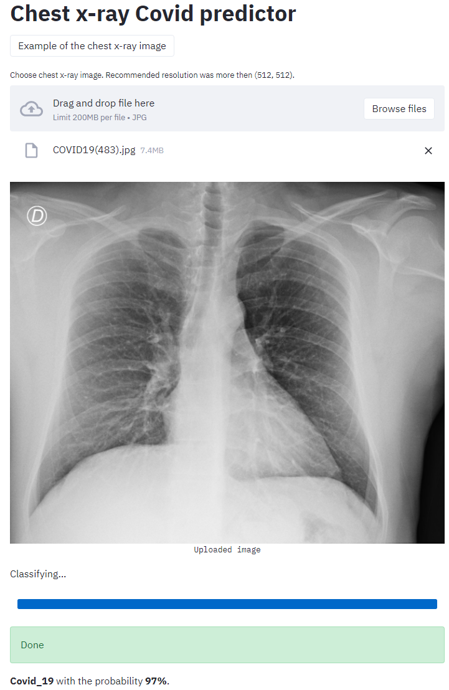

# StreamlitLangs_demo
Chest X-ray imageclassification for COVID-19 and pneumonia detection with CNN (demo).
Train chest x-ray image was received from the [Kaggle Chest X-ray (Covid-19 & Pneumonia)](https://www.kaggle.com/prashant268/chest-xray-covid19-pneumonia)

Example:

